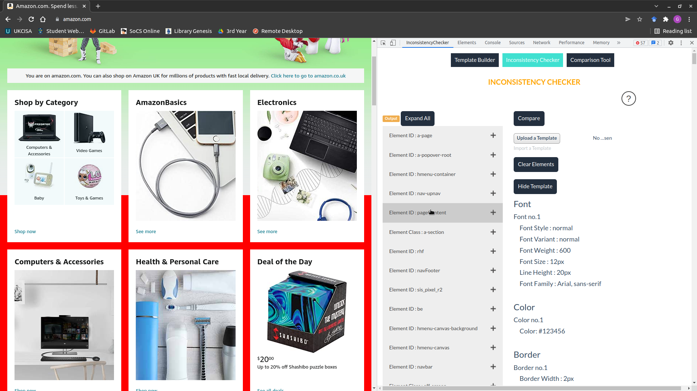

# Inconsistency checker

Inconsistency checker is a Chrome extension for finding UI inconsistencies on webpages. 

Users can create, edit, download and upload templates, which are sets of CSS properties that define consistent elements.

The extension compares the template against the elements on the current webpage in order to find UI inconsistencies.

## Documentation

Visit the [Inconsistency Checker wiki](https://stgit.dcs.gla.ac.uk/team-project-h/2021/se04/se04-main/-/wikis/home) for documentation. Some useful links:
- [How to use the Template Builder](https://stgit.dcs.gla.ac.uk/team-project-h/2021/se04/se04-main/-/wikis/how-to-use-the-template-builder)
- [How to use the Inconsistency Checker](https://stgit.dcs.gla.ac.uk/team-project-h/2021/se04/se04-main/-/wikis/how-to-use-the-inconsistency-checker)
- [How to use the Comparison Tool](https://stgit.dcs.gla.ac.uk/team-project-h/2021/se04/se04-main/-/wikis/how-to-use-the-comparison-tool)

## Installation instructions

Clone the extension and manually load it as an 'Unpacked extension' via the extensions page.

For more detailed installation instructions click [here](https://stgit.dcs.gla.ac.uk/team-project-h/2021/se04/se04-main/-/wikis/installation-instructions).

## License

[GNU GPLv3](https://www.gnu.org/licenses/gpl-3.0.html).

## Acknowledgements 
Based on [SnappySnippet](https://github.com/kdzwinel/SnappySnippet).
